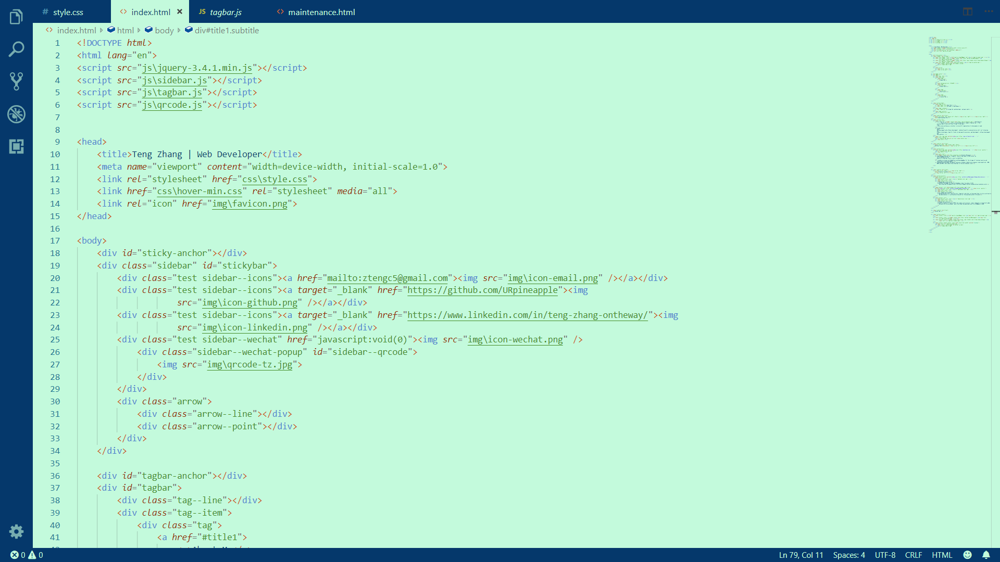

## **Description**

**"Salad"** is a color theme designed to provide an eye-relaxing experience for users. It has deep support for **HTML**, **CSS**, and **JavaScript**.

Dark color themes may look cool but could also be exhausting to look at. That's why I created this color theme using light green and dark blue as my main color, which I found to be surprisingly comfortable to work with. It's as healthy as a salad except it's for your eyes. Hope you can enjoy using it as well!!!

*Don't forget to give me a five-star review if you like my work!*

## **Screenshots**

### **HTML**

### **CSS**

### **JS**

