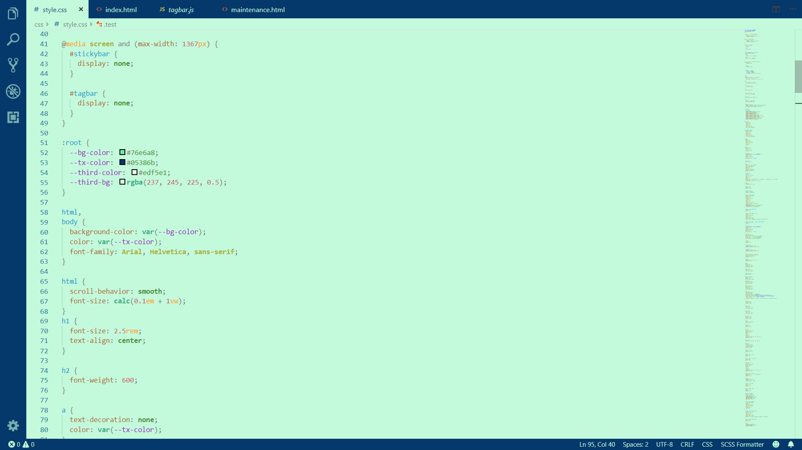
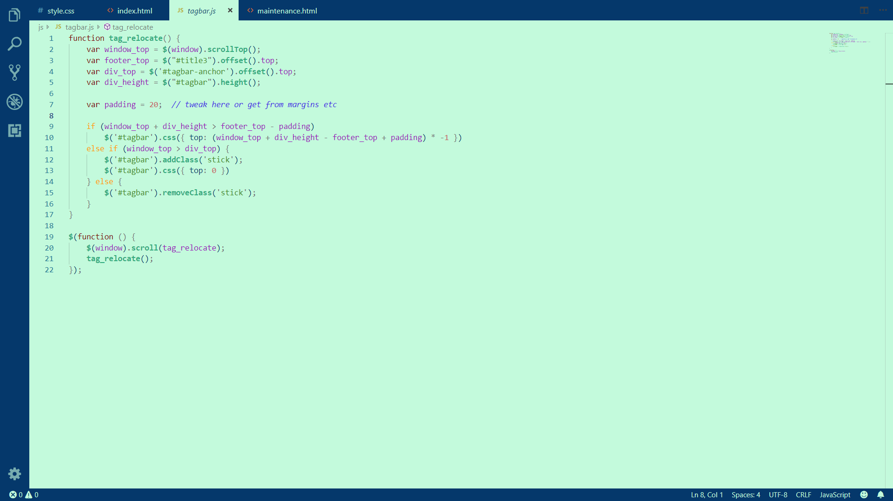

## **Description**

**"Earth"** is a color theme designed to provide an eye-relaxing experience for users. It has deep support for **HTML**, **CSS**, and **JavaScript**.

Dark themes may look cool but could also get your eyes tired very easily. That's why I created this color theme using light green and dark blue. I personally found it surprisingly comfortable to work with. Hope you can enjoy using it as well.

*Don't forget to give me a five-star review if you like my work!*

## **Screenshots**

### **HTML**

### **CSS**

### **JS**

